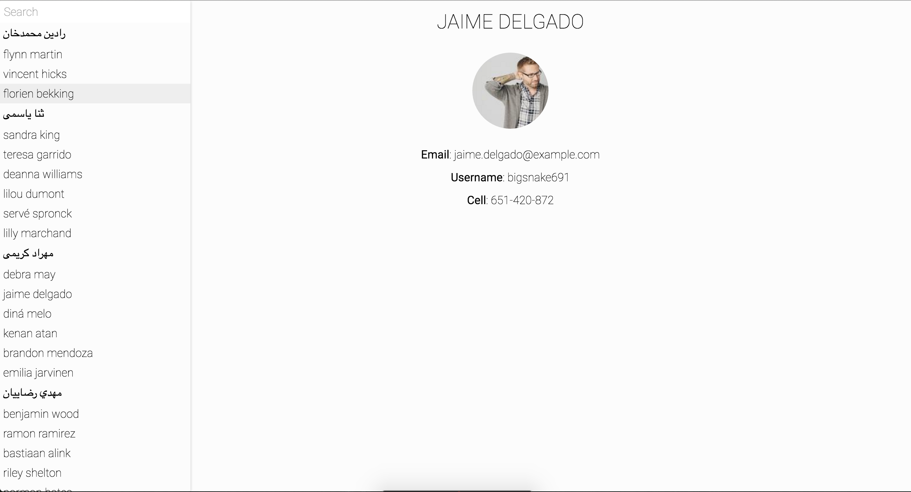

# What We Will Build

We are going to focus our efforts on building a small but usable company directory search UI using the randomuser.me api.

Here is the screen shot on the final project:

We will go over some technical requirements a little later.

We will also provide the style sheet as this is not about CSS.

During this project we will go over language basics, tooling, static elements, dynamic elements from data, and functional programing concepts.

## What This Tutorial is Not

1. A full guide to the Elm language
2. A full introduction to functional programing

Lets talk about each point really quick.

### Not a full guide to the Elm language

This training will teach a lot of concepts about the Elm language, but it is no way going to be 100% comprehensive. Often times I see my self getting board while working through 5 chapters of language concepts, and never completing a tutorial or book. Instead there will be a really quick language primer to get us going, and then we will introduce language concepts along the way, interjecting them as we go.

### Complete functional Programing introduction

Functional programing is a vast and rich area of programing that has taken many very smart people many years to master. If you want a super deep dive into learning functional programming and some of the more advanced topics within that paradigm I would recommend two things:

1. Buy Haskell Book: http://haskellbook.com/
2. Actually read the book and learn Haskell

However, for most of us I believe Elm is the prefect starting point to functional programming. It is a small, simple language, with great documentation and a friendly community trying to help new functional programmers the best they can. And if it seems like something you are more interested in, then you can go through the two items from above.

Lets get to the code!
